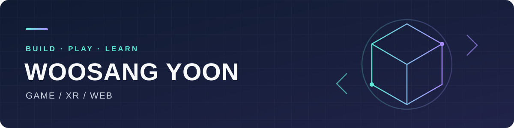

### 안녕하세요, 윤우상입니다 👋

Unity로 게임과 AR·VR 경험을 만들고, 웹과 앱으로 개발 영역을 넓혀가고 있습니다. 
직접 만들고 배우며, 프로젝트와 학습 과정을 이곳에 기록합니다.

---

## 🧭 이런 프로젝트를 만들고 있습니다

- **게임** — VR 리듬 액션, 모바일 생존 회피, 2D 대시 플랫포머
- **AR·VR** — 이미지 인식 동물 앱과 한국 전통놀이 VR 체험
- **앱·웹** — Unity 이미지 검색 UI와 React 기반 토스 미니앱

## 🛠️ 프로젝트에서 사용하는 기술

**게임 · XR**

**웹 · 미니앱**

## 🎮 게임 · AR · VR 프로젝트

| 프로젝트 | 내용 | 기술 | 비고 |
| :--- | :--- | :--- | :--- |
| [VRRhythmGame](https://github.com/ssa25879/VRRhythmGame) | 세이버로 노트를 베는 VR 리듬 게임. 방향·속도 판정, 점수·콤보·HP, 스테이지 선택과 결과 화면 | Unity · C# · OpenXR | Meta Quest 3S · [포트폴리오](https://github.com/ssa25879/VRRhythmGame/blob/main/Docs/Portfolio.md) · [시연 영상](https://youtu.be/3g2RF_wvLGw) |
| [BlockDodge](https://github.com/ssa25879/BlockDodge) | 탄막을 피하는 생존 회피 게임. 조이스틱 이동, 무적 회피·쿨다운, 시간 기반 난이도와 최고 기록 | Unity · C# · URP | Android |
| [2DFlatformerGame](https://github.com/ssa25879/2DFlatformerGame) | 마우스 방향 대시 중심 2D 플랫포머. 대시 재충전, 함정·목표 판정, 스테이지 선택과 순차 잠금 해제 | Unity · C# · 2D Tilemap | 프로토타입 |
| [ARBook](https://github.com/ssa25879/VRBook) | 이미지 인식으로 3D 동물 표시. 트래킹 상태에 따른 표시·숨김, 터치 시 울음소리 재생 | Unity · C# · AR Foundation | Android · 저장소명: VRBook · [구현 설명](https://github.com/ssa25879/VRBook/blob/main/Assets/Scripts/README.md) |

## 🌐 앱 · 웹 프로젝트

| 프로젝트 | 내용 | 기술 | 비고 |
| :--- | :--- | :--- | :--- |
| [UsingAI-ImageSearchApp](https://github.com/ssa25879/UsingAI-ImageSearchApp) | Pixabay·Mock 검색 전환과 비동기 썸네일 로딩을 갖춘 세로형 이미지 검색 UI 앱 | Unity · C# · UI Toolkit · UniTask | — |
| [포트폴리오 웹사이트](https://github.com/ssa25879/ssa25879.github.io) | 자기소개와 프로젝트를 정리한 개인 포트폴리오. 프로젝트 상세 보기, 반응형 레이아웃과 다크모드 | HTML · CSS · JavaScript | [사이트 보기](https://ssa25879.github.io/) |

## 📚 학습 기록

기초 언어부터 엔진 활용까지, 수업과 실습 내용을 저장소로 정리합니다.

| 분야 | 저장소 | 학습 내용 |
| :--- | :--- | :--- |
| Unreal · C++ | [UnrealPractice](https://github.com/ssa25879/UnrealPractice) | Unreal Engine C++ 실습 |
| C | [Polytech_C_basic](https://github.com/ssa25879/Polytech_C_basic) | C 기초 수업 기록 |
| Java | [polytech_java2](https://github.com/ssa25879/polytech_java2) | 수업·과제용 포크 저장소 |
| C# | [csharp-sourse-2026](https://github.com/ssa25879/csharp-sourse-2026) | 객체지향, 프로퍼티, 상속과 다형성 |
| 디버깅 | [csharp-debug-exam](https://github.com/ssa25879/csharp-debug-exam) | 오류 분석과 수정 실습용 저장소 |

## 🚧 현재 작업 중

현재 개발하고 있는 프로젝트입니다.

| 프로젝트 | 내용 | 기술 |
| :--- | :--- | :--- |
| [ModooTraditionalPlay](https://github.com/ssa25879/ModooTraditionalPlay) | 장구 리듬·사방치기, 체험 공간 이동과 문 상호작용을 다루는 한국 전통놀이 VR 협업 프로젝트 | Unity · C# · XR Interaction Toolkit |
| [ait-FridgePick](https://github.com/ssa25879/ait-FridgePick) | 보유 재료와 난이도·재료 일치율 조건으로 레시피를 추천하는 토스 미니앱 | React · TypeScript · Vite · Apps in Toss |

---

<b>직접 만들고, 배우고, 기록합니다.</b>  
<a href="mailto:ssaqwe123@gmail.com">ssaqwe123@gmail.com</a> · <a href="https://github.com/ssa25879?tab=repositories">전체 프로젝트 둘러보기</a>

